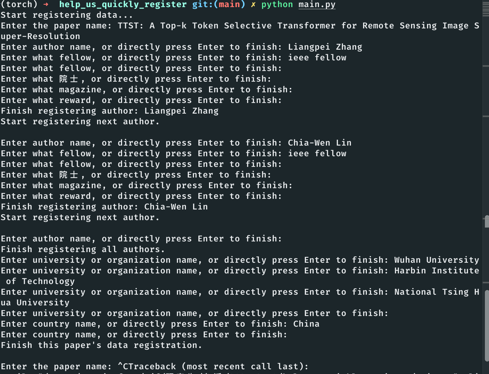

# help_us_quickly_register

## 登记方式
如图

如上登记，research_data.json中就会多出
```
[
  {
    "引用论文": "TTST: A Top-k Token Selective Transformer for Remote Sensing Image Super-Resolution",
    "著名学者（院士+IEEE/ACM Fellow）": "Liangpei Zhang (ieee fellow, ); Chia-Wen Lin (ieee fellow, )",
    "国际期刊主编": "",
    "国家": "China",
    "所有机构": "Wuhan University; Harbin Institute of Technology; National Tsing Hua University",
    "知名荣誉获得者（诺贝尔、图灵奖等）": ""
  }
]
```
这样一段记录。
程序会在登记完一篇论文后保存记录，此时可以直接ctrl+c退出程序。下次登记的内容会继续加在research_data.json末尾。

### 登记格式
如果作者担任多个职务/院士、多个国际期刊主编、获得多个奖项，请在交互界面完整输入，并以`, `间隔，如：
```
IEEE Fellow, ACM Fellow
# 其他项同理
中国工程院院士, 中国科学院院士
诺贝尔奖, 图灵奖
```


## TODO
- [ ] 将json转化成excel脚本
- [ ] 国家/机构去重脚本
